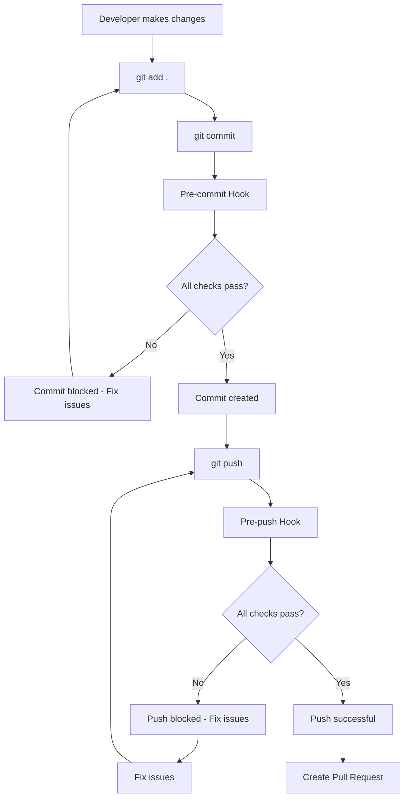

# Qylon Git-Flow Automation Guide

## 🎯 Overview

This document describes the automated Git-flow process implemented for the Qylon AI Automation Platform. The system enforces local testing and validation before any Pull Request (PR) is submitted, significantly reducing CI/CD pipeline failures and associated costs.

## 🏗️ Architecture

### Core Components

1. **Pre-commit Hook** - Validates code before commits
2. **Pre-push Hook** - Comprehensive validation before pushing to remote
3. **Security Scanning** - Multiple security tools integration
4. **Test Automation** - Unit, integration, and coverage validation
5. **Code Quality** - Linting, formatting, and link validation
6. **Branch Management** - Naming conventions and protection rules

### Process Flow



## 🚀 Quick Start

### 1. Initial Setup

Run the setup script to install all Git hooks and dependencies:

```bash
./scripts/setup-git-hooks.sh
```

This script will:
- Install pre-commit and pre-push hooks
- Install required dependencies
- Configure security tools
- Set up configuration files

### 2. Create a Feature Branch

```bash
# Validate current branch
npm run validate:branch

# Create new feature branch
git checkout -b feature/JIRA-123-add-user-authentication
```

### 3. Development Workflow

```bash
# Make your changes
# ... edit files ...

# Stage changes
git add .

# Commit (triggers pre-commit hook)
git commit -m "feat: add user authentication system"

# Push (triggers pre-push hook)
git push origin feature/JIRA-123-add-user-authentication
```

## 📋 Validation Checks

### Pre-commit Hook Checks

The pre-commit hook runs the following validations:

#### 1. Branch Management
- ✅ Prevents direct commits to protected branches (`main`, `develop`, `master`)
- ✅ Validates branch naming conventions
- ✅ Enforces feature/bugfix/hotfix/chore prefixes

#### 2. Code Formatting and Linting
- ✅ **TypeScript/JavaScript**: ESLint with security rules
- ✅ **Python**: Black, isort, flake8
- ✅ **Code Formatting**: Prettier for consistent styling

#### 3. Link Validation
- ✅ Checks internal documentation links
- ✅ Validates external links (HTTP/HTTPS)
- ✅ Reports broken links with context

#### 4. Unit Tests
- ✅ Runs all unit tests
- ✅ Enforces 80% code coverage threshold
- ✅ Generates coverage reports

#### 5. Security Scan
- ✅ TypeScript compilation security check
- ✅ ESLint security analysis
- ✅ NPM audit for vulnerabilities
- ✅ Python Bandit security scan (if available)

#### 6. Integration Tests
- ✅ Runs critical integration tests
- ✅ Validates service interactions

### Pre-push Hook Checks

The pre-push hook includes all pre-commit checks plus:

#### 7. Enhanced Security Scan
- ✅ Comprehensive npm audit
- ✅ Snyk vulnerability scan (if available)
- ✅ Retire.js scan (if available)
- ✅ Audit-ci scan (if available)
- ✅ Trivy container scan (if available)

#### 8. Build Validation
- ✅ Tests build process
- ✅ Validates Docker builds
- ✅ Checks database migrations

#### 9. Performance Tests
- ✅ Runs critical performance tests
- ✅ Load testing validation

#### 10. Health Check Validation
- ✅ Validates service health checks
- ✅ Tests service startup

## 🛠️ Configuration

### Branch Naming Conventions

The system enforces the following branch naming patterns:

```
feature/JIRA-XXXX-short-description
bugfix/JIRA-XXXX-short-description
hotfix/JIRA-XXXX-short-description
chore/JIRA-XXXX-short-description
release/1.0.0
```

**Examples:**
- `feature/JIRA-123-add-user-authentication`
- `bugfix/JIRA-456-fix-login-bug`
- `hotfix/JIRA-789-critical-security-fix`
- `chore/JIRA-101-update-dependencies`

### Coverage Thresholds

```javascript
// jest.config.js
coverageThreshold: {
  global: {
    branches: 80,
    functions: 80,
    lines: 80,
    statements: 80,
  },
}
```

### Security Thresholds

```bash
# scripts/security-test.sh
CRITICAL_THRESHOLD=0    # No critical vulnerabilities allowed
HIGH_THRESHOLD=0        # No high vulnerabilities allowed
MODERATE_THRESHOLD=5    # Up to 5 moderate vulnerabilities allowed
LOW_THRESHOLD=10        # Up to 10 low vulnerabilities allowed
```

## 🔧 Available Scripts

### Test Scripts

```bash
# Run all tests with coverage
npm run test:runner

# Run only unit tests
npm run test:runner:unit

# Run only integration tests
npm run test:runner:integration

# Run only coverage analysis
npm run test:runner:coverage
```

### Validation Scripts

```bash
# Validate branch naming and status
npm run validate:branch

# Check all links
npm run validate:links

# Check only internal links
npm run validate:links:internal

# Check only external links
npm run validate:links:external
```

### Security Scripts

```bash
# Run comprehensive security scan
npm run security:scan

# Run specific security scans
npm run security:scan:npm
npm run security:scan:snyk
npm run security:scan:retire
npm run security:scan:audit-ci
npm run security:scan:eslint
```

## 🚨 Troubleshooting

### Common Issues

#### 1. Pre-commit Hook Fails

**Problem**: Code formatting or linting issues
**Solution**:
```bash
# Fix formatting
npm run format

# Fix linting
npm run lint:fix

# For Python files
black .
isort .
flake8 .
```

#### 2. Test Coverage Below Threshold

**Problem**: Coverage below 80%
**Solution**:
```bash
# Check coverage report
npm run test:coverage

# View detailed coverage
npm run test:coverage:html
# Open coverage/index.html in browser
```

#### 3. Security Vulnerabilities

**Problem**: Security scan finds vulnerabilities
**Solution**:
```bash
# Check specific vulnerabilities
npm audit

# Fix automatically fixable issues
npm audit fix

# For Python vulnerabilities
bandit -r services/
```

#### 4. Branch Naming Issues

**Problem**: Branch doesn't follow naming convention
**Solution**:
```bash
# Rename current branch
git branch -m feature/JIRA-123-correct-name

# Or create new branch with correct name
git checkout -b feature/JIRA-123-correct-name
```

### Bypassing Hooks (Emergency Only)

⚠️ **Warning**: Only use in emergency situations

```bash
# Skip pre-commit hook
git commit --no-verify -m "emergency: critical fix"

# Skip pre-push hook
git push --no-verify origin branch-name
```

## 📊 Monitoring and Reporting

### Coverage Reports

Coverage reports are generated in multiple formats:
- **Terminal**: Real-time coverage during test runs
- **HTML**: `coverage/index.html` for detailed analysis
- **JSON**: `coverage/coverage-summary.json` for CI/CD integration

### Security Reports

Security scan results are available in:
- **Terminal**: Real-time vulnerability reports
- **JSON**: `bandit-report.json` for Python security issues
- **Audit logs**: npm audit output for dependency vulnerabilities

### Performance Metrics

Performance test results include:
- **Load test results**: Response times and throughput
- **Memory usage**: Peak and average memory consumption
- **CPU utilization**: Resource usage patterns

## 🔄 CI/CD Integration

### GitHub Actions Integration

The local validation system is designed to work seamlessly with CI/CD pipelines:

```yaml
# .github/workflows/ci.yml
name: CI/CD Pipeline
on: [push, pull_request]

jobs:
  validate:
    runs-on: ubuntu-latest
    steps:
      - uses: actions/checkout@v3
      - name: Setup Node.js
        uses: actions/setup-node@v3
        with:
          node-version: '20'
      - name: Install dependencies
        run: npm install
      - name: Run validation
        run: |
          npm run validate:branch
          npm run test:runner
          npm run security:scan
          npm run validate:links
```

### Pre-commit CI Integration

```yaml
# .pre-commit-config.yaml
repos:
  - repo: local
    hooks:
      - id: qylon-pre-commit
        name: Qylon Pre-commit Hook
        entry: .git/hooks/pre-commit
        language: system
        pass_filenames: false
        always_run: true
```

## 📚 Best Practices

### Development Workflow

1. **Always create feature branches** from `develop`
2. **Follow naming conventions** strictly
3. **Write tests first** (TDD approach)
4. **Keep commits small** and focused
5. **Write descriptive commit messages**
6. **Run validation locally** before pushing

### Code Quality

1. **Maintain high test coverage** (80%+)
2. **Fix security vulnerabilities** immediately
3. **Keep dependencies updated**
4. **Use consistent formatting**
5. **Document complex logic**

### Security

1. **Never commit secrets** or API keys
2. **Use environment variables** for configuration
3. **Validate all inputs** thoroughly
4. **Keep security tools updated**
5. **Review security reports** regularly

## 🆘 Support

### Getting Help

1. **Check this documentation** first
2. **Run validation scripts** to identify issues
3. **Check logs** in the terminal output
4. **Contact the development team** for complex issues

### Team Contacts

- **Chief Architect**: Bill (siwale) - Core services and architecture
- **Security Lead**: Bill (siwale) - Security framework and compliance
- **DevOps Lead**: Tekena - CI/CD and infrastructure

### Resources

- **Technical Design**: `docs/Qylon Technical Design Doc.md`
- **Security Setup**: `docs/SECURITY_SETUP.md`
- **Development Status**: `DEVELOPMENT_STATUS.md`
- **API Documentation**: `docs/api/`

---

**Remember**: This automation system is designed to help maintain code quality and security. When in doubt, fix the issues rather than bypassing the checks. The time invested in maintaining quality will pay dividends in reduced bugs, faster development, and better security posture.
